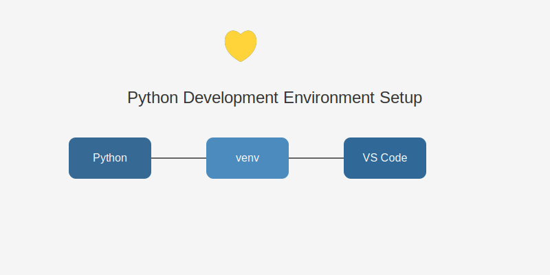

# 第一章：Python环境搭建



在开始学习Python编程之前，我们需要先在电脑上安装必要的工具和环境。本章将指导您完成这个过程。

## 本章内容

1. [Python安装指南](./python-installation.md) - 在Windows和macOS系统上安装Python
2. [代码编辑器配置](./vscode-setup.md) - 安装和配置VS Code
3. [虚拟环境设置](./virtual-environment.md) - 创建和管理Python虚拟环境

## 1. Python安装

### Windows系统
1. 访问Python官网：https://www.python.org/downloads/
2. 点击"Download Python 3.x.x"（选择最新的稳定版本）
3. 下载安装程序后双击运行
4. 重要：勾选"Add Python to PATH"选项
5. 点击"Install Now"开始安装

### macOS系统
1. 访问Python官网：https://www.python.org/downloads/
2. 下载macOS版本的安装程序
3. 双击下载的.pkg文件
4. 按照安装向导完成安装

### 验证安装
打开终端（命令提示符），输入：
```bash
python --version
```
如果看到类似"Python 3.x.x"的输出，说明安装成功。

## 2. 安装代码编辑器

我们推荐使用Visual Studio Code（VS Code）作为代码编辑器：

1. 访问：https://code.visualstudio.com/
2. 下载并安装VS Code
3. 安装Python扩展：
   - 打开VS Code
   - 点击左侧扩展图标（或按Ctrl+Shift+X）
   - 搜索"Python"
   - 安装Microsoft的Python扩展

## 3. 配置Python环境

### 创建虚拟环境
虚拟环境可以为不同的项目创建独立的Python环境。在终端中执行：

```bash
# Windows
python -m venv llm-env

# macOS/Linux
python3 -m venv llm-env
```

### 激活虚拟环境

```bash
# Windows
llm-env\Scripts\activate

# macOS/Linux
source llm-env/bin/activate
```

### 安装基础包
```bash
pip install requests python-dotenv openai
```

## 4. 测试环境

创建一个测试文件 `test.py`：

```python
print("Hello, LLM World!")
```

运行这个文件：
```bash
python test.py
```

如果看到输出"Hello, LLM World!"，说明环境配置成功！

## 5. 常见问题解决

### Python未添加到PATH
- Windows：重新运行安装程序，确保勾选"Add Python to PATH"
- macOS：确保在终端中使用python3命令

### pip命令未找到
- Windows：确保Python安装时勾选了pip选项
- macOS：使用命令 `python3 -m pip install --upgrade pip`

### 虚拟环境激活失败
- 检查是否在正确的目录下
- Windows可能需要修改执行策略：`Set-ExecutionPolicy RemoteSigned -Scope CurrentUser`

## 下一步

环境配置完成后，您就可以开始学习Python基础语法了。在下一章中，我们将学习Python的基本概念和语法规则。

## 练习
1. 确认Python安装成功
2. 安装并配置VS Code
3. 创建并激活虚拟环境
4. 运行第一个Python程序

## 额外资源
- [Python官方文档](https://docs.python.org/)
- [VS Code Python教程](https://code.visualstudio.com/docs/python/python-tutorial)
- [pip包管理工具文档](https://pip.pypa.io/)
