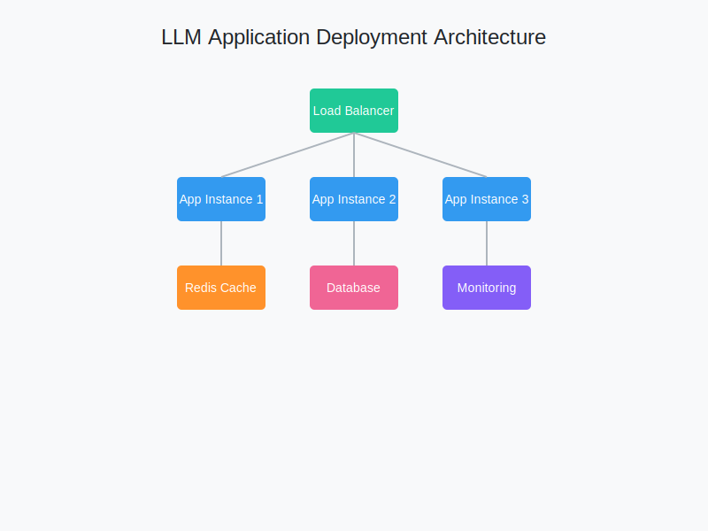

# 部署策略与最佳实践



## 1. 容器化部署

### Docker基础配置
```dockerfile
# Dockerfile
FROM python:3.9-slim

WORKDIR /app

COPY requirements.txt .
RUN pip install --no-cache-dir -r requirements.txt

COPY . .

CMD ["uvicorn", "app.main:app", "--host", "0.0.0.0", "--port", "8000"]
```

### 多阶段构建
```dockerfile
# 构建阶段
FROM python:3.9-slim as builder

WORKDIR /app
COPY requirements.txt .
RUN pip install --no-cache-dir -r requirements.txt

# 运行阶段
FROM python:3.9-slim
COPY --from=builder /usr/local/lib/python3.9/site-packages/ /usr/local/lib/python3.9/site-packages/
COPY . .

CMD ["uvicorn", "app.main:app", "--host", "0.0.0.0", "--port", "8000"]
```

## 2. CI/CD流程

### GitHub Actions配置
```yaml
name: Deploy LLM Application

on:
  push:
    branches: [ main ]

jobs:
  build-and-deploy:
    runs-on: ubuntu-latest
    steps:
    - uses: actions/checkout@v2
    
    - name: Set up Python
      uses: actions/setup-python@v2
      with:
        python-version: '3.9'
    
    - name: Install dependencies
      run: |
        python -m pip install --upgrade pip
        pip install -r requirements.txt
    
    - name: Run tests
      run: pytest
    
    - name: Build and push Docker image
      run: |
        docker build -t my-llm-app .
        docker push my-llm-app
```

## 3. 生产环境配置

### 环境变量管理
```python
# settings.py
from pydantic_settings import BaseSettings

class Settings(BaseSettings):
    openai_api_key: str
    model_name: str = "gpt-3.5-turbo"
    max_tokens: int = 1000
    temperature: float = 0.7
    redis_url: str
    
    class Config:
        env_file = ".env"
```

### 负载均衡配置
```nginx
# nginx.conf
upstream llm_app {
    server app1:8000;
    server app2:8000;
    server app3:8000;
}

server {
    listen 80;
    server_name example.com;

    location / {
        proxy_pass http://llm_app;
        proxy_set_header Host $host;
        proxy_set_header X-Real-IP $remote_addr;
    }
}
```

## 4. 监控与日志

### Prometheus指标配置
```python
from prometheus_client import Counter, Histogram

REQUEST_COUNT = Counter(
    'llm_request_total',
    'Total LLM API requests',
    ['model', 'status']
)

RESPONSE_TIME = Histogram(
    'llm_response_time_seconds',
    'Response time in seconds',
    ['model']
)
```

### 日志配置
```python
import logging
from logging.handlers import RotatingFileHandler

logger = logging.getLogger('llm_app')
logger.setLevel(logging.INFO)

handler = RotatingFileHandler(
    'app.log',
    maxBytes=10000000,
    backupCount=5
)
handler.setFormatter(
    logging.Formatter('%(asctime)s - %(name)s - %(levelname)s - %(message)s')
)
logger.addHandler(handler)
```

## 5. 性能优化

### 缓存策略
```python
from functools import lru_cache
from redis import Redis

redis_client = Redis.from_url(settings.redis_url)

def get_cached_response(prompt: str) -> str:
    cache_key = f"llm:response:{hash(prompt)}"
    
    # 检查Redis缓存
    if cached := redis_client.get(cache_key):
        return cached.decode()
    
    # 获取新响应
    response = get_llm_response(prompt)
    
    # 设置缓存，1小时过期
    redis_client.setex(cache_key, 3600, response)
    return response

@lru_cache(maxsize=1000)
def get_llm_response(prompt: str) -> str:
    # LLM API调用实现
    pass
```

### 异步处理
```python
from fastapi import FastAPI, BackgroundTasks
from redis import Redis

app = FastAPI()
redis_client = Redis.from_url(settings.redis_url)

@app.post("/process")
async def process_request(request: Request, background_tasks: BackgroundTasks):
    task_id = str(uuid.uuid4())
    background_tasks.add_task(process_llm_request, task_id, request.prompt)
    return {"task_id": task_id}

@app.get("/status/{task_id}")
async def get_status(task_id: str):
    result = redis_client.get(f"task:{task_id}")
    return {"status": "completed" if result else "processing"}
```

## 6. 安全性配置

### API认证
```python
from fastapi import FastAPI, Security
from fastapi.security import APIKeyHeader

api_key_header = APIKeyHeader(name="X-API-Key")

@app.post("/predict")
async def predict(
    request: Request,
    api_key: str = Security(api_key_header)
):
    if not is_valid_api_key(api_key):
        raise HTTPException(
            status_code=403,
            detail="Invalid API key"
        )
    # 处理请求
```

### 速率限制
```python
from fastapi import FastAPI
from slowapi import Limiter, _rate_limit_exceeded_handler
from slowapi.util import get_remote_address

limiter = Limiter(key_func=get_remote_address)
app = FastAPI()
app.state.limiter = limiter
app.add_exception_handler(RateLimitExceeded, _rate_limit_exceeded_handler)

@app.post("/predict")
@limiter.limit("5/minute")
async def predict(request: Request):
    # 处理请求
```

## 部署检查清单

1. **环境配置**
   - [ ] 环境变量设置
   - [ ] 依赖版本固定
   - [ ] 配置文件分离

2. **安全措施**
   - [ ] API认证实现
   - [ ] 速率限制配置
   - [ ] HTTPS配置
   - [ ] 敏感信息加密

3. **监控系统**
   - [ ] 日志收集
   - [ ] 性能指标
   - [ ] 告警配置
   - [ ] 健康检查

4. **备份策略**
   - [ ] 数据备份
   - [ ] 配置备份
   - [ ] 恢复流程

5. **扩展性**
   - [ ] 负载均衡
   - [ ] 自动扩缩容
   - [ ] 服务发现

6. **文档**
   - [ ] API文档
   - [ ] 部署文档
   - [ ] 运维手册
   - [ ] 故障处理指南